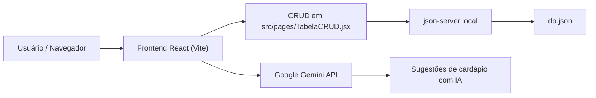

# Documentação de Programação Dinâmica para Web


## Visão geral

Este documento descreve a parte do projeto destinada à disciplina de **Programação Dinâmica para Web**.

O sistema apresenta um frontend React criado com Vite, que implementa um CRUD de pratos do bandejão e uma sugestão de cardápio com IA.

## Estrutura de frontend

O projeto está organizado em componentes e páginas React sob `src/`.

### Diagrama de fluxo Web



### Página principal de CRUD

O CRUD de pratos está implementado em `src/pages/TabelaCRUD.jsx`.

O fluxo é o seguinte:

- `buscarProdutos()` realiza `fetch(${API_URL}/produtos)` para ler produtos.
- `handleCadastrar()` envia `POST ${API_URL}/produtos` para criar um novo prato.
- `handleExcluir(id)` envia `DELETE ${API_URL}/produtos/${id}` para remover um prato.
- `handleMudarStatus(produto)` envia `PUT ${API_URL}/produtos/${produto.id}` para trocar o status de disponibilidade.

Todas as chamadas usam `async/await` para garantir a comunicação assíncrona com a API.

## Backend local com json-server

A aplicação usa `json-server` como API simulada. O arquivo de banco de dados local é `db.json`.

A URL local configurada em `src/apiConfig.js` é:

```js
export const API_URL = "http://localhost:3000";
```

### Como rodar localmente para avaliação Web

```bash
cd cardapio-bandeijao
npm install
npx json-server --watch db.json --port 3000
npm run dev
```

Acesse a aplicação pelo endereço fornecido pelo Vite.

## Integração com IA

O sistema também integra o pacote `@google/generative-ai` em `src/pages/TabelaCRUD.jsx`.

A função `gerarSugestaoComIA()`:

- cria um cliente `GoogleGenerativeAI` com a variável de ambiente `VITE_GEMINI_API_KEY`,
- solicita sugestões de pratos com prompt de nutricionista do bandejão,
- exibe o resultado no frontend.

> Para usar a IA, configure `VITE_GEMINI_API_KEY` no ambiente do Vite.

## Observações

Esta documentação cobre a entrega de Web, com foco no CRUD, no uso de `fetch` assíncrono e na integração com IA no frontend.
