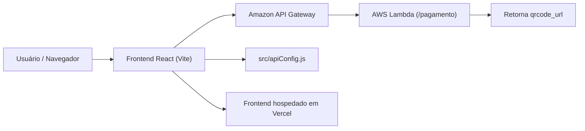

# Documentação de Sistemas Distribuídos


## Visão geral

Este documento descreve a parte do projeto dedicada à disciplina de **Sistemas Distribuídos**.

O frontend React/Vite se comunica com serviços em nuvem via uma arquitetura serverless, usando **Amazon API Gateway** e **AWS Lambda**.

## Arquitetura Serverless

A ideia central é manter o frontend hospedado de forma estática (por exemplo, em Vercel) e delegar o processamento de recarga para a AWS.

### Diagrama de arquitetura distribuída



### Componentes principais

- **Frontend React**: roda no navegador e faz solicitações HTTP.
- **API Gateway**: expõe um endpoint público que recebe chamadas do frontend.
- **AWS Lambda**: função serverless que gera o QR Code PIX ou o código de pagamento para o cartão RU.

## Como o frontend usa a nuvem

A página `src/pages/Recarga.jsx` implementa a recarga do cartão RU.

O fluxo é:

1. O usuário informa `Número do cartão` e `Valor da recarga`.
2. Ao clicar em **Gerar QR Code via Lambda**, o frontend chama:

```js
const API_URL = "https://um4of5exti.execute-api.us-east-1.amazonaws.com/deploy-02";
const response = await fetch(`${API_URL}/pagamento`);
```

3. A Lambda retorna um objeto JSON com a propriedade `qrcode_url`.
4. O frontend exibe o QR Code usando ``.

## API Gateway e Lambda

A API em nuvem é exposta pelo Amazon API Gateway no deploy `deploy-02`.

A função AWS Lambda deve:

- ser acionada pelo caminho `/pagamento`,
- gerar um payload de QR Code para pagamento PIX,
- retornar um JSON com o campo `qrcode_url`.

Esse processo entrega a funcionalidade de recarga sem rodar um servidor tradicional no frontend.

## `apiConfig.js` como chave de alternância

O arquivo `src/apiConfig.js` centraliza a base URL da API.

```js
// URL PARA AULA DE PROGRAMAÇÃO WEB (JSON Server Local)
export const API_URL = "http://localhost:3000";

// URL PARA AULA DE SISTEMAS DISTRIBUÍDOS (AWS)
// export const API_URL = "https://um4of5exti.execute-api.us-east-1.amazonaws.com/deploy-02";
```

Para avaliar a solução de Sistemas Distribuídos, altere essa configuração para utilizar a URL da AWS.

## Observações importantes

- A parte local do projeto continua usando `json-server` e `db.json`.
- A recarga via AWS é o componente que demonstra claramente a divisão entre as duas disciplinas.
- O App mistura abordagens, mas o `apiConfig.js` permite alternar o backend entre local e nuvem.

## Recomendações

- Use `Vercel` para hospedar o frontend estático.
- Use `AWS Lambda` e `API Gateway` para funções sem servidor.
- Garanta que o endpoint remoto retorne o campo `qrcode_url` no formato esperado.
