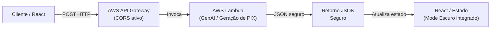

# Documentação de Sistemas Distribuídos


## 1. Visão Geral do Projeto

O projeto consiste em um sistema inteligente para o Restaurante Universitário (RU), integrando:

- um frontend React com navegação por rotas e componentes reutilizáveis;
- um módulo de recarga de cartão RU com backend em nuvem;
- cadastro e gerenciamento de cardápio com suporte a inteligência artificial para sugestões nutricionais.

### Objetivos do sistema

- **Facilidade de recarga**: permitir geração de QR Code Pix via backend serverless para carga segura no cartão RU.
- **Transparência no cardápio**: expor menu semanal e informações nutricionais com atualização assíncrona.
- **Uso de inteligência artificial**: fornecer recomendações de alimentação e auxiliar a administração do cardápio com insights gerados por IA.

## 2. Arquitetura do Sistema (Sistemas Distribuídos vs. Web)

### Separação de responsabilidades

O sistema adota um modelo clássico de frontend web desacoplado e backend distribuído:

- **Frontend React/Vite**: roda localmente no navegador ou em hospedagem estática, consumindo APIs via `fetch`.
- **Backend distribuído**: opera na AWS como funções serverless, isolando logicamente o processamento de pagamento e de IA.

Essa separação garante que a interface do usuário permaneça leve e responsiva, enquanto a lógica sensível é executada em ambiente controlado.

### Ecossistema AWS utilizado

O backend distribuído usa os seguintes componentes AWS:

- **Amazon API Gateway**: expõe endpoints REST seguros para o frontend;
- **AWS Lambda**: executa funções serverless responsáveis pela geração de QR Code e pelo processamento de IA;
- **IAM / roles**: controla permissões de execução sem expor credenciais no cliente.

### Justificativa arquitetural de segurança

A abordagem de proxy seguro em nuvem é necessária para proteger duas categorias de dados:

- **chaves de pagamento e credenciais do gateway financeiro**;
- **tokens de API e credenciais de modelos de IA**.

Ao manter o processamento de IA e pagamentos na AWS, o projeto evita:

- exposição de chaves diretamente no frontend;
- vulnerabilidades de segurança em clientes que podem ser inspecionados ou modificados;
- execução de lógica sensível em ambientes não confiáveis.

## 3. Fluxograma de Arquitetura Distribuída (Mermaid)



## 4. Módulos Implementados (Visão Técnica)

### Módulo 1: Tela Home (Visibilidade e Métricas)

A `Home` apresenta o cardápio semanal com consumo assíncrono de dados locais e visualizações dinâmicas.

- Fonte de dados: `public/data/cardapio.json` ou `db.json` em ambiente de desenvolvimento.
- Renderização: carrossel de pratos via `CarouselCardapio.jsx`.
- Métricas: total de calorias calculadas e exibidas no componente `GraficoCalorias.jsx`.

Exemplo de chamada assíncrona:

```js
const fetchCardapio = async () => {
  const response = await fetch('/data/cardapio.json');
  const cardapio = await response.json();
  setCardapio(cardapio);
};
```

### Módulo 2: Tela de Recarga do Cartão (Processamento AWS)

A `Recarga` é implementada como um card padronizado com formulário e botão de ação.

- O usuário informa `Número do cartão` e `Valor`.
- A interface aciona o endpoint AWS Lambda via API Gateway.
- A Lambda retorna a URL do QR Code Pix para exibição imediata.

Fluxo de chamada:

```js
const gerarQrCode = async () => {
  const response = await fetch(`${API_URL}/pagamento`, {
    method: 'POST',
    headers: { 'Content-Type': 'application/json' },
    body: JSON.stringify({ cartao, valor }),
  });
  const payload = await response.json();
  setQrCodeUrl(payload.qrcode_url);
};
```

### Módulo 3: Tela de Administração (CRUD & IA)

A tela de administração permite gerenciar produtos do cardápio e acionar o assistente de nutrição.

- CRUD completo: Create, Read, Update (disponível / esgotado), Delete.
- Consumo de API local ou remota para manter `pratos` sincronizados.
- Botão de Assistente de Nutrição que invoca a IA via endpoint seguro.

Exemplo de chamada para a IA:

```js
const buscarSugestaoIA = async () => {
  const response = await fetch(`${API_URL}/cardapio`, {
    method: 'POST',
    headers: { 'Content-Type': 'application/json' },
    body: JSON.stringify({ descricao: prato.descricao }),
  });
  const dados = await response.json();
  setSugestao(dados.sugestao);
};
```

## 4. Tratamento de Desafios Técnicos e Erros Corrigidos

### CORS (Cross-Origin Resource Sharing)

A configuração do API Gateway foi ajustada para permitir:

- requisições de `http://localhost:5173` durante desenvolvimento;
- métodos `GET`, `POST`, `PUT`, `DELETE` e `OPTIONS` quando necessário;
- cabeçalhos `Content-Type` e `Authorization` em chamadas de API.

Essa configuração evita erros de bloqueio no navegador e mantém a comunicação segura entre frontend e backend.

### Gerenciamento de Estados e Sincronismo

O frontend faz uso consistente de hooks React:

- `useState` para estados locais de loading, dados, erro e resposta da IA;
- `useEffect` para carregar o cardápio e os dados iniciais na montagem do componente;
- atualizações em tempo real após ações CRUD para manter a interface consistente.

Exemplo de sincronização pós-CRUD:

```js
const excluirPrato = async (id) => {
  await fetch(`${API_URL}/produtos/${id}`, { method: 'DELETE' });
  setProdutos((prev) => prev.filter((item) => item.id !== id));
};
```

### Padronização Visual e Acessibilidade (Dark Mode)

A engenharia de CSS foi aplicada para garantir legibilidade e coesão visual:

- uso de variáveis de cor e estados de foco para botões e campos;
- botões de sucesso `verde` mantêm contraste em temas claros e escuros;
- caixas de texto pré-formatado (`<pre>`) preservam tipografia e não quebram a identidade visual.

Essa padronização reduz bugs de contraste e melhora a experiência de usuários com diferentes preferências de tema.

## 5. Mapeamento de Endpoints do API Gateway

| Endpoint | Método | Responsabilidade | Observações |
|---|---|---|---|
| `/pagamento` | `POST` | Geração de QR Code Pix para recarga | Recebe `cartao` e `valor` no corpo da requisição |
| `/cardapio` | `POST` | Assistente de IA para sugestões nutricionais | Recebe descrição do prato e retorna recomendação |
| `/produtos` | `GET` | Listagem de pratos | Usado pela tela de administração |
| `/produtos/{id}` | `PUT` | Atualiza status ou dados de prato | Suporta `disponivel` / `esgotado` |
| `/produtos/{id}` | `DELETE` | Remove prato | Atualiza interface imediatamente |

## 6. Considerações Finais

A documentação consolida a integração entre disciplinas: Sistemas Distribuídos fornece o backend seguro e escalável, enquanto Desenvolvimento Web entrega a interface interativa e responsiva.

O uso de AWS Lambda e API Gateway é um exemplo real de arquitetura serverless moderna, ao passo que a separação clara entre frontend e backend mantém o projeto modular e sustentável.
